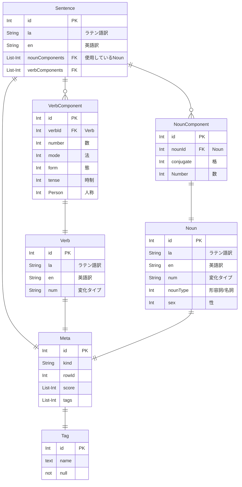

# Database

```mermaid
erDiagram
  Verb {
    Int id PK
    String la "ラテン語訳"
    String en "英語訳"
    String num "変化タイプ"
  }

  Noun {
    Int id PK
    String la "ラテン語訳"
    String en "英語訳"
    String num "変化タイプ"
    Int nounType "形容詞/名詞"
    Int sex "性"
  }

  Sentence {
    Int id PK
    String la "ラテン語訳"
    String en "英語訳"
    List-Int nounComponents FK "使用しているNoun"
    List-Int verbComponents FK
  }

  NounComponent {
    Int id PK
    Int nounId FK "Noun"
    Int conjugate "格"
    Int Number "数"
  }

  VerbComponent {
    Int id PK
    Int verbId FK "Verb"
    Int number "数"
    Int mode "法"
    Int form "態"
    Int tense "時制"
    Int Person "人称"
  }

  Meta {
    Int id PK
    String kind
    Int rowId
    List-Int score
    List-Int tags
  }

  Tag {
    Int id PK
    text name not null
  }

  Sentence ||--o{ NounComponent : ""
  Sentence ||--o{ VerbComponent : ""

  NounComponent ||--|| Noun : ""
  VerbComponent ||--|| Verb : ""

  Sentence ||--|| Meta: ""
  Verb ||--|| Meta : ""
  Noun ||--|| Meta : ""

  Meta ||--|| Tag : ""

```
